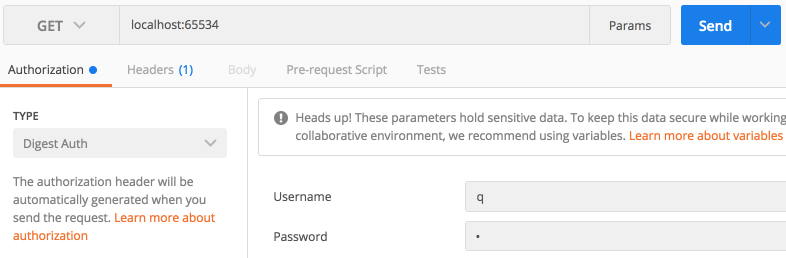

# digest-auth-examples

Example patterns for using Digest Authentication with a range of Java HTTP Clients.

Tested with HTTP requests to a MarkLogic HTTP Application Server (using MarkLogic 9.0-3 and above) configured with "Digest Authentication" to demonstrate the possible uses for some common Java HTTP Client Libraries with Digest Authentication.

## Working code examples

- ASync HTTP Client
- Apache HTTP Components (HTTP Client)
- OkHTTP
- Jersey Client

## Non-working code examples (currently broken / WIP)

- Google HTTP Client ()
- Jetty Client (See: https://github.com/eclipse/jetty.project/pull/2159)
- Netty (_ASync HTTP Client is built on Netty_)

## The pattern

To see how Digest Authentication works between client and server, you can use cURL with the -Lvso switches:

```
curl --digest --user q:q -Lvso /dev/null http://localhost:65534
```

Below is a simple example of a curl GET call where Digest Authentication is used in the Request/Response including the authentication headers from both sides:

```bash
curl --anyauth --user q:q -i -X GET 'http://localhost:65534'
HTTP/1.1 401 Unauthorized
Server: MarkLogic
WWW-Authenticate: Digest realm="public", qop="auth", nonce="35e2a7a98da338:IZsXr6ZTryi4ct7ZtWMC7g==", opaque="23928c8c7e58e1ea"
Content-Type: text/html; charset=utf-8
Content-Length: 209
Connection: Keep-Alive
Keep-Alive: timeout=5

HTTP/1.1 200 OK
Server: MarkLogic
Content-Type: text/plain; charset=UTF-8
Content-Length: 346
Connection: Keep-Alive
Keep-Alive: timeout=5
```

```bash
curl --digest --user q:q -Lvso /dev/null http://localhost:65534
* Rebuilt URL to: http://localhost:65534/
*   Trying ::1...
* TCP_NODELAY set
* Connected to localhost (::1) port 65534 (#0)
* Server auth using Digest with user 'q'
> GET / HTTP/1.1
> Host: localhost:65534
> User-Agent: curl/7.54.0
> Accept: */*
>
< HTTP/1.1 401 Unauthorized
< Server: MarkLogic
< WWW-Authenticate: Digest realm="public", qop="auth", nonce="35e32eb2b27240:wLUp/u/8HKC2UEk7fkmkDA==", opaque="5ed25b49530f2224"
< Content-Type: text/html; charset=utf-8
< Content-Length: 209
< Connection: Keep-Alive
< Keep-Alive: timeout=5
<
* Ignoring the response-body
{ [209 bytes data]
* Connection #0 to host localhost left intact
* Issue another request to this URL: 'http://localhost:65534/'
* Found bundle for host localhost: 0x7fc5a2c0bba0 [can pipeline]
* Re-using existing connection! (#0) with host localhost
* Connected to localhost (::1) port 65534 (#0)
* Server auth using Digest with user 'q'
> GET / HTTP/1.1
> Host: localhost:65534
> Authorization: Digest username="q", realm="public", nonce="35e32eb2b27240:wLUp/u/8HKC2UEk7fkmkDA==", uri="/", cnonce="MWIzNjAxNWY1MzliOWI0Y2UxNDcyZjY5ZjE2Y2ZiZjU=", nc=00000001, qop=auth, response="f7f00dce41fc1a0b0200758922e697f3", opaque="5ed25b49530f2224"
> User-Agent: curl/7.54.0
> Accept: */*
>
< HTTP/1.1 200 OK
< Server: MarkLogic
< Content-Type: text/plain; charset=UTF-8
< Content-Length: 346
< Connection: Keep-Alive
< Keep-Alive: timeout=5
<
{ [346 bytes data]
* Connection #0 to host localhost left intact
```

You can also test Digest Authentication using Postman:


Look under the headers tab and you can see what gets sent to MarkLogic for authentication:
```
Digest username="q", realm="public", nonce="35e3735b67647e:Z1ls84xeix9/xKVykKKpDQ==", uri="/", qop=auth, nc=00000001, cnonce="qX677A6i", response="9c09ad4b9a7ce11bb4f3718e68c1fea2", opaque="44c12dc1dde9e525"
```